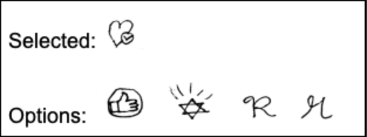

# Design Manifesto
The world of product design was a mystery at the start of this semester. I had no idea what methods, dynamics, and practices were used when a team made decisions about the directions they would take their product in. A lot of what I learned came from reading various texts on the subject and actually designing a [product](https://ethioeph.github.io/muse-soc-network/) with a [team](https://ethioeph.github.io/muse-soc-network/assignments/team_contract/). Working with a team allowed me to gain the experience of working with a team and figuring out how to effectively design a product that meets users’ needs. The takeaways of my experience were masked by five points that defined my design process:
* Understanding the user and creating a product for them
* Iteration! Bring out many ideas and designs in order to improve the product.
* Receiving lots of feedback improved my understanding of the design process and made for a better design.
* Being transparent and thorough with users sets an ethical foundation.
* Thinking about how different users will interact with the product and making it accessible to all.

## Understanding the user and creating a product for them
One of the first things I learned is that I am not the user. Many times, developers and designers forget to realize that the way they see the product is different than how actual users will interact and use said product. This is discussed in a reading I did this semester called The Psychopathology of Everyday Things, in which the author describes how many objects are not used as intended. An example of this how some doors are poorly designed, so people incorrectly push/pull them without opening them. These so called Norman doors are a prime example of designers not knowing how their audience will interact with their design.

To combat this, my team and I conducted a series of [contextual inquiries](https://ethioeph.github.io/muse-soc-network/assignments/ci_review/) in which we went to where users would generally use our envisioned product and see themes that arose from their interactions with art and social media. From these observations we learned things that we had not imagined. One of these being that people of a diverse age groups think about sharing art through social media. In doing the inquiries, we also identified half a dozen [tasks](https://ethioeph.github.io/muse-soc-network/assignments/task_review/) that users wish they could do, so we tailored our product to be able to fulfill them. This was all done to gain an understanding of a product that would meet people’s needs and that would actually be used by them.

Every user is different, so constant communication with different users is needed during the design process. In order to design a product that meets the users’ needs and is easy to use, we needed to be constantly talking to a diverse set of users to see if our vision and interpretation of a solution matched theirs.

## Receiving constant feedback
Once we had a [paper prototype](https://ethioeph.github.io/muse-soc-network/assignments/paper_prototype/) we thought hit the main tasks and satisfied the users, I did a [heuristic evaluation](https://ethioeph.github.io/muse-soc-network/assignments/heuristic_evaluations/) of our design with two other students from a different team. In this test, I learned that even though we had a fair understanding of the problem and people’s involvement in it, designing a medium for our product was not as straightforward as I thought it was. They were quick to point out some heuristics that were broken in our original prototype. Without this feedback we would have continued with a flawed design. 

Feedback came in handy when we were deciding which logo to use for our “recommendations” tab. At first, we used the logo for our product but found that users struggled to find the right tab and resorted to random navigation until they saw it. We then came up with a couple different designs for the button, some did not make sense to users, others took some time to interpret, while others were understood quite fast. We ended up picking the one that was most liked by users which also happened to be the design that took the shortest time to understand.

(Different logos we tried for the recommendation button)

Each deliverable was also thoroughly reviewed and commented by our professor, [Iris](http://www.cs.williams.edu/~iris/). As an amateur designer, I benefited a lot from Iris’s feedback. She was able to point out the mistakes in my understanding of the material as well as on the terminology used. All in all, the design process should be supervised by someone with more experience in the field like a manager or a professor. 
## Iteration! Bring out many ideas and designs in order to improve the product. 
During one of our lectures, Iris told us of a study that was done in a ceramics class. One half of the students were told to produce work of the highest quality, while the other half was told to make as many ceramics as possible. It turns out that the latter actually produced better work. This is because by making more pieces, they were able to fix their flaws as they kept iterating. I applied this to our design process to reduce the number of flaws our product has.
My team and I went through different approaches to our design. From a webpage to an interactive app on a museum wall, we brainstormed multiple ideas and narrowed it down to [three](https://ethioeph.github.io/muse-soc-network/assignments/designs/). The iteration of multiple ideas allowed us to explore all the different possibilities instead of being stuck in one design that could not have been the best one. 

Once we selected to start designing our product as an app, we began doing [usability testing](https://ethioeph.github.io/muse-soc-network/assignments/usability_testing_review/) on our prototypes. In order to address differences between the user base, it was important that we diversified our subjects. During these iterative tests, we discovered flaws at each test and quickly solved them before conducting the upcoming tests. After each iteration, our design was more defined and contained less user issues. The issues we had in one test did not persist after our improvements which meant our design was becoming more usable. 

It was difficult to do more than three usability tests and to produce more iterations of our design because of schedule conflicts and time conflicts. For an upcoming design, I would spend more time iterating and playing more with different design options. Ideally, each group member does their own iterations and we evaluate them all together. Instead, we worked on different designs in unison, which meant the number of designs we made was limited. 

## Code of Ethics
It is said that a bad designer can be identified if they do not focus on the ethical implications of their product. The infamous case of the [Therac-25](http://wla.berkeley.edu/~cs61a/reader/Therac-25.pdf) is the staple of a terrible code of ethics in a company. AECL is the company responsible for this incident and my code of ethics reflects the opposite of theirs during this event.
* __Be transparent:__ many companies hide a lot of information and policies under long terms of services that users inevitably skip. I advocate that any implications of the product are presented up front.
* __Test thoroughly:__ one of the reasons why people kept being overdose during the Therac-25 event was due to the poor amount of testing. AECL would recommend fixes to the machine that were not directly correlated to the issue presented to them. In order to avoid this, companies should be able to duplicate errors reported to them and ensure that their fix passes any new tests that identified the error. Thorough testing does not avoid bugs, it exposes existing bugs in software. These bugs can have ethical implications on the users.
* __Respect privacy:__ information that the user indicates to be private should be private. This may sound obvious but a lot of companies fail to do this. Facebook for example had issues with people’s friends being notified of when users would join groups without the users’ consent. Users’ pictures that were thought to be private were also accessible from outside sources. This led to people’s personal information being shared to and possibly misinterpreted by the public.

## Accessibility
Making a product accessible to a wide audience should be a goal for any company. Having a wider audience allows a greater variety of people to benefit from using a product. Designing without accessibility in mind limits the scope of the product because designers are not necessarily hindered by the lack of accessibility features. One can determine if their design is accessible by making sure it passes the [POUR](https://theblog.adobe.com/design-with-accessibility-in-mind-the-pour-methodology/) methodology. That is, making sure the design is Perceivable, Operable, Understandable, and Robust.

Our product has the goal of making sharing art more accessible to all users. On top of this, we made our [app](https://ethioeph.github.io/muse-soc-network/assignments/digital_mockup/) accessible. We stayed away from jargon associated with museums and tech to create a more inviting design that anyone could use. We also resorted to using a font similar to comic sans as it is friendly to people with dyslexia. Also, some people have trouble distinguishing some colors, so we avoided having colors be necessary when navigating through the app. 

## Conclusion
This is the recipe I learned for a good design. These takeaways are general enough to be applied to another project but specific enough to maintain good design practices. A good design will shape the direction of any product; it lays the foundation for the developers and sets a connection with the users.

