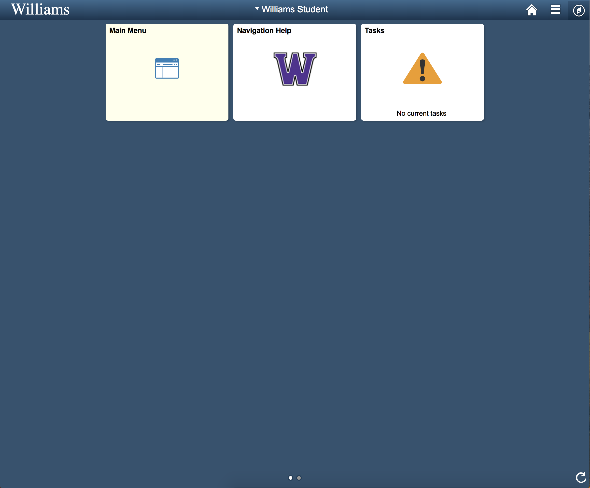
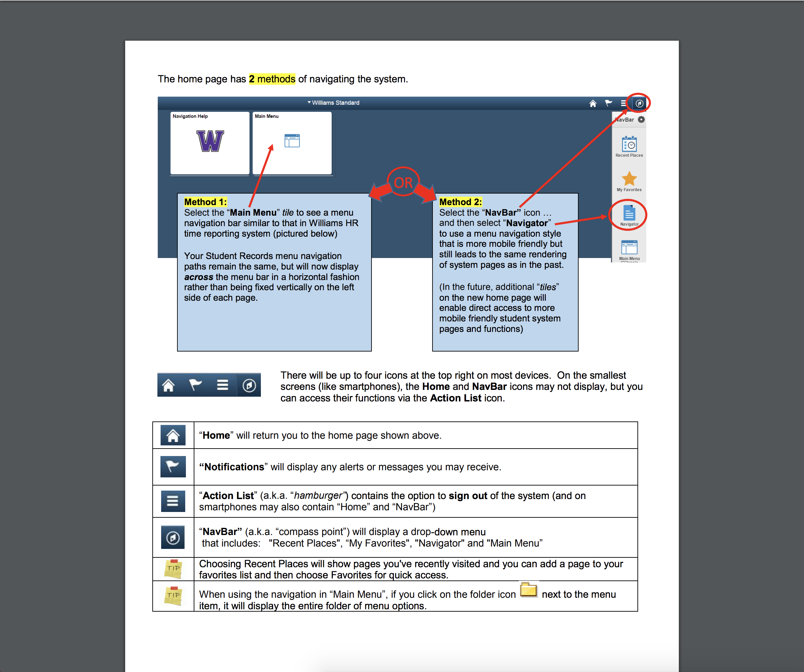
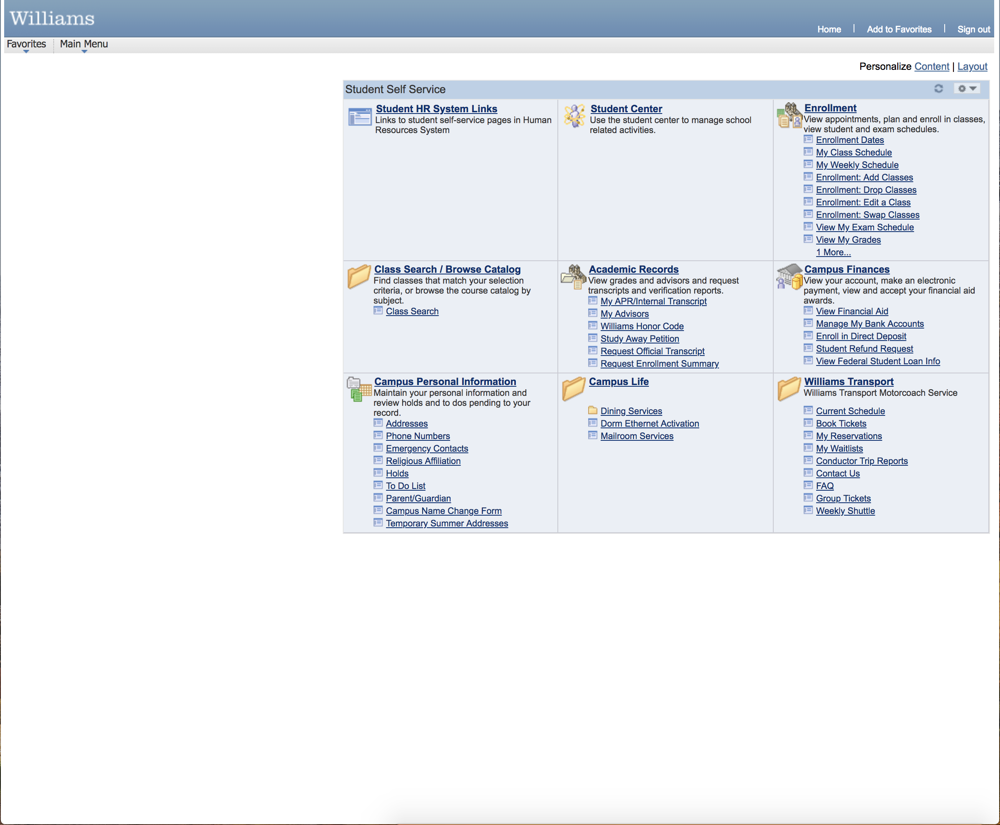
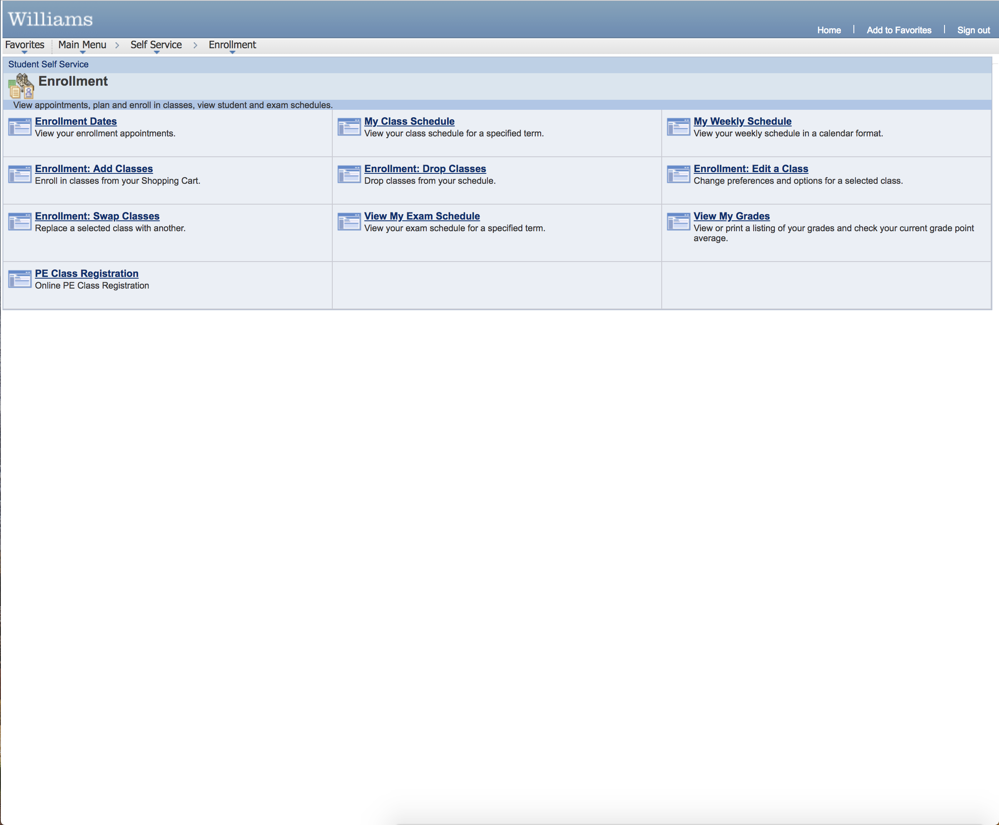
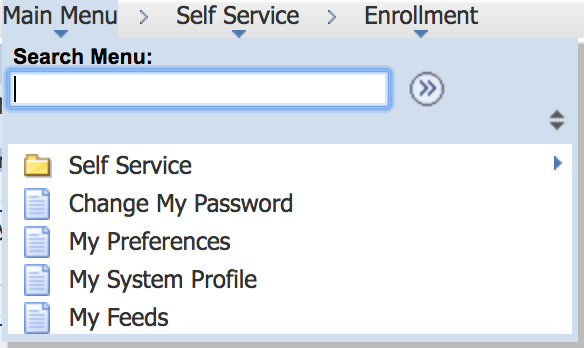

The Williams [PeopleSoft](http://sarah.williams.edu) website is one of the first experiences incoming students have with the school.
What could be a website that brings excitement about the start of a new school turns out to be a nightmare.

Students use this website to register for classes, find information about their financial aid, view their campus address, and anything administrative that deals with them.

**Walkthrough**
This is a walkthrough and explanation of the frustrations students have with this website.

The home page seems like it offers a lot. A link to the main menu and a list of tasks. However, tasks never get populated and students just want to get into the main menu without going through the home page.

The Navigation Help button is also bad design because it provides little to no help and it takes the user to a pdf file:

This does not even show the tasks button and emphasizes aspects of the page that are irrelevant. The Home button takes the user to the home page which as discussed above has no functionality.

The main menu is where all of the important links are found, such as enrolling in classes, looking at our schedule, and booking busses:

There are many bad design choices on this page. The boxes are left aligned, there is a lot of empty white space, the "1 more..." button takes the user to a different page instead of expanding the box.

This is the expanded list of enrollment items. The home button is irrelevant because it takes the user to the useless home page. The main menu button on the top left opens a drop down menu instead of taking the user to the main menu.

The drop down menu is not even that helpful. Users would rather be taken to the main menu page directly.
